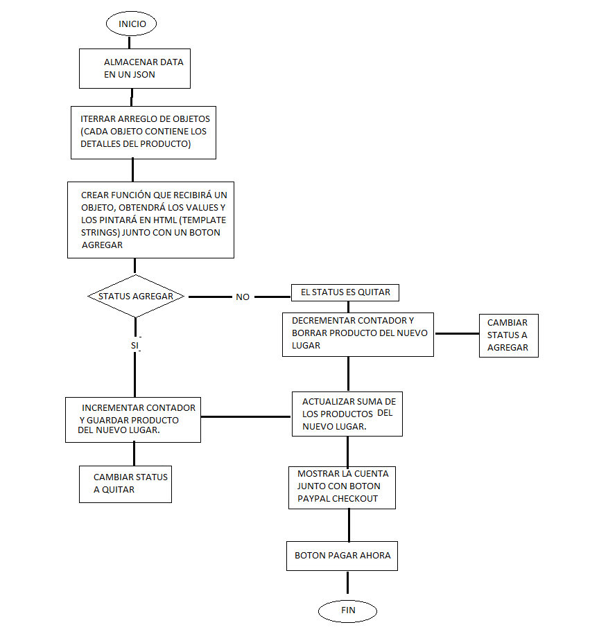

# SIMPLE ECOMMERCE

## Pseudocodigo

1. Tener una data tipo JSON para poder almacenar todos los detalles de los producto, como un array es más fácil de manejar, entonces la forma de acceder a ese arreglo será: data.products.
2. Definir lo el trabajo a realizar de las siguientes funciones:

*a* - drawProducts (recibira una data), pintará los produtos que se encuentran en la data.

 *b* - createProductHTML (recibirá un objeto), el contenido del objeto se añadira a un template para después agregarlo al doc HTML.

*c* - addToCart (): Se ejecutará cuando se de click en el botón añadir al carrito (cuando se agrega debe de aparecerquitar del carrito, llamar función "changeButtonStatus"), función llamar increaseCounter, se guardará en nombre del producto y su precio en un arreglo (para facilitar que se borre).

  - *c.1* - changeButtonStatus, función con condicional que preguntará por el status, si status es igual a agregar se remplazará por un quitar, de otra manera remplazar por agregar (porque el status se da por hecho que es quitar).

  - *c.2* - increaseCounter, accederá al elemento existente que mostrará al contador actual, contador+1.

*d* - calculateTotal, realizara la operación aritmetica de suma, de los productos que se encuentren en el carrito (arreglo con objetos, objetos que se encuentran en la data original, forma de acceder: data.products[i].prince).

*e* - removeFromCart (recibirá contador, nombre y precio),llama función "decreaseCounter" hará que el contador disminuya en 1.

  - *e.1* - decreaseCounter, accederá al elemento existente que mostrará al contador actual, contador-1.

## Diagrama de flujo:

### Instrucciones

https://docs.google.com/document/d/1T7XiaQQxl9S9I0NgZ0E5y5pWYD9nJSfoi0v8rYyv-k8/edit?usp=sharing
